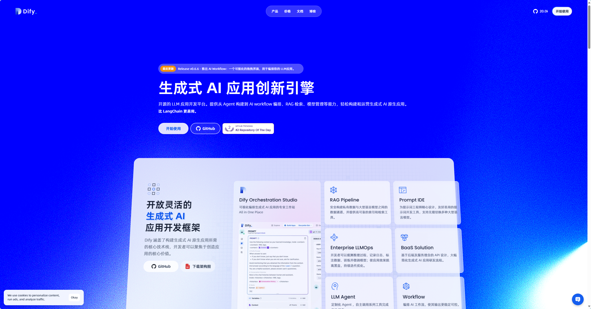
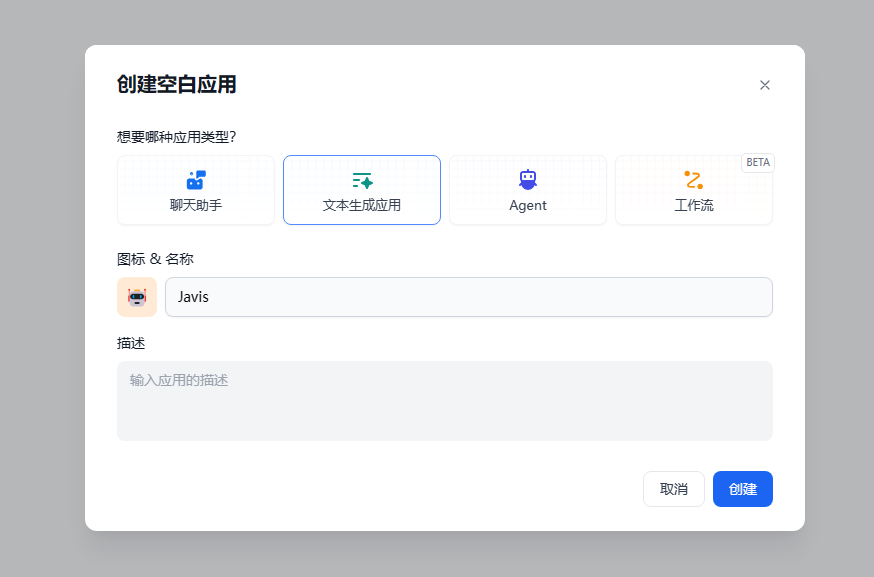
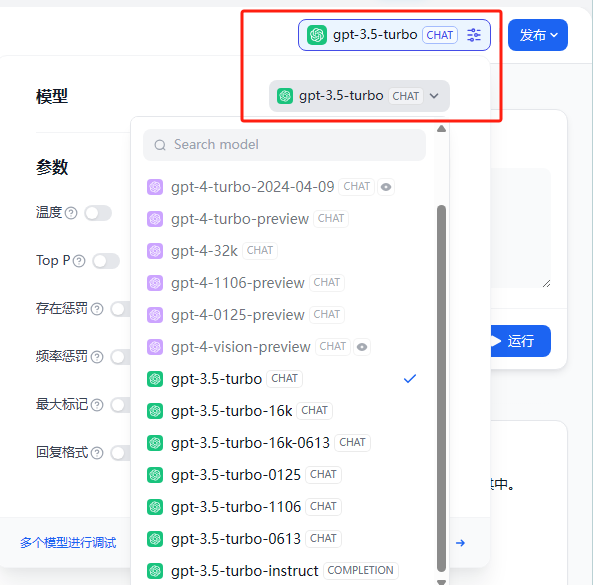
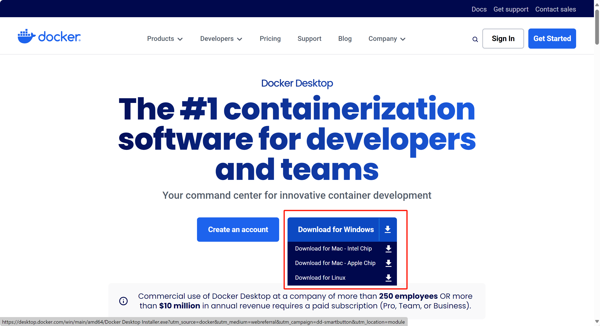
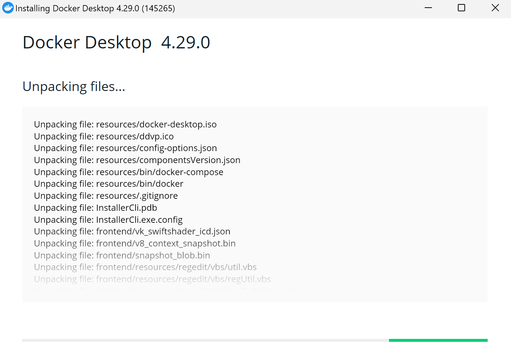
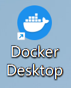
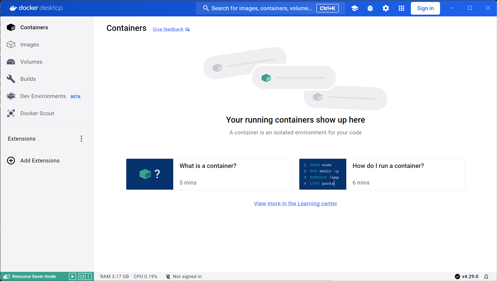
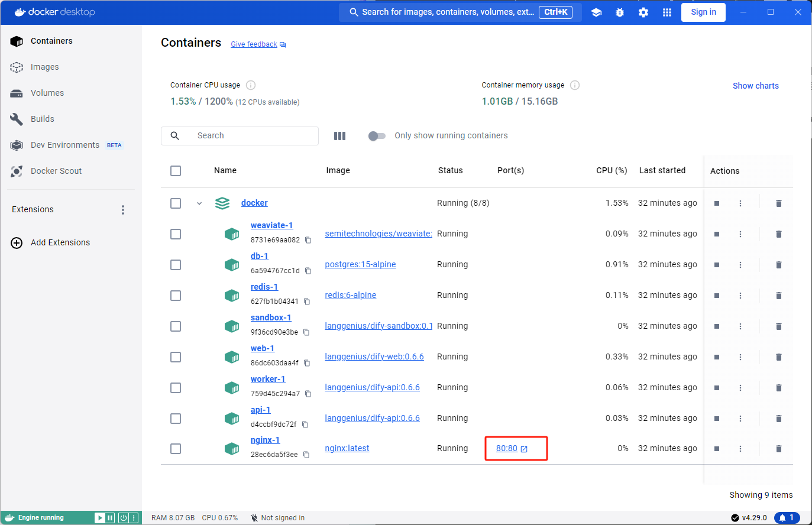
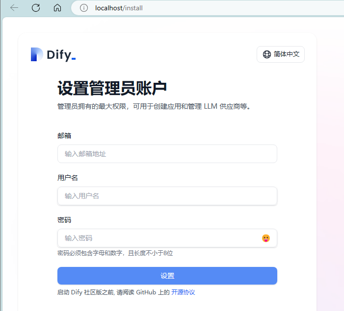

本节目录：

- [1. Dify 使用方法](1-Dify-使用方法)
- [2. 使用 Dify 云服务](#2-使用-dify-云服务)
- [3. 使用 Docker 本地部署 Dify （可选）](#3-使用-docker-本地部署-dify-可选)
  - [3.1 安装 Docker ](#31-安装-docker)
  - [3.2 使用 Docker 部署 Dify](#32-使用-docker-部署-dify)
- [4. 踩坑记录：](#4-踩坑记录)
- [参考资料](#参考资料)

# 1. Dify 使用方法
Dify 提供了2种使用方式，一种是使用 Dify 官方提供的[云服务](https://cloud.dify.ai/apps)，无需自己部署即可使用 Dify 的完整功能。注意使用 Dify 云服务需要你有一个 Github 或 Google 账号；另一种是自己部署 Dify 社区版（即开源版本）。

如无本地部署需求，建议大家使用 Dify 云服务更加方便快捷。若需要在本地部署使用 Dify 社区版，Dify 提供了以下两种方式：
- [Docker Compose部署](https://docs.dify.ai/v/zh-hans/getting-started/install-self-hosted/docker-compose)
- [本地源码启动](https://docs.dify.ai/v/zh-hans/getting-started/install-self-hosted/local-source-code)

这里推荐 Docker Compose 方式进行部署，能避免许多环境配置上的坑。

# 2. 使用 Dify 云服务
首先，点击 [这里](https://dify.ai/zh) 进入 Dify 官网：



点击 **开始使用** （英文界面点击 Get Started），首次使用可以用 Github 或 Google 账号登录。登录后即可看到如下页面：


然后就可以开始创建我们的大模型应用啦😎

举个简单例子：
点击创建空白应用 -> 文本生成应用 -> 取名 -> 创建：



接着可以在左侧设置前缀提示词，变量参数、访问api等，在右侧键入用户输入进行调试预览，然后点击运行即可看到调式结果：


右上角可以选择采用的大语言模型，并设定模型参数。默认采用`gpt-3.5-turbo`模型，GPT4模型需要钞能力解锁。



以上就是一个简单的使用 Dify 搭建聊天助手的示例，后续课程中会带来更多进阶玩法。

# 3. 使用 Docker 本地部署 Dify （可选）
如果您需要本地部署 Dify，这里推荐使用 Docker 进行部署，可以避免很多环境依赖的问题。

## 3.1 安装 Docker 
[Docker](https://www.docker.com/#) 是一种容器化平台，可以帮助开发者将应用程序及其所有依赖项打包到一个标准化的单元中，称为容器。这使得应用程序在不同的环境中能够快速、可靠地部署和运行，提高了开发、交付和运维的效率。

点击[Docker官网链接](https://www.docker.com/products/docker-desktop/)，然后选择适合自己电脑系统的版本进行下载安装。这里以 Windows 系统为例：



点击选择**Download for Windows**，下载 docker 桌面版，然后按照提示一步步安装即可。


这一步需要用到 WSL 2，一种在 Windows 操作系统上运行 Linux 环境的技术。如果你的电脑不支持的话可以网上搜索相关教程或博客进行安装。




然后即可在电脑桌面发现 docker 的图标：



双击运行：


点击 `Accept` 同意用户协议，然后会出现一个注册登录界面：


如果你之前已经注册过 docker 账号可以点击`Sign in`登录，或者点击`Sign up`注册账号。当然，没有 docker 账号也没关系，可以直接点击`Continue without signing in`跳过这一步骤。

接着会有一个调查问卷：


这个问卷和使用关系不大，随便选或者点击下方`Skip survey`跳过即可。



当出现以上界面时即代表 docker 安装成功。

## 3.2 使用 Docker 部署 Dify
下一步，我们来使用 docker 部署dify。

首先，克隆 Dify 源代码至本地：

```bash
git clone https://github.com/langgenius/dify.git
```


然后，复制以下命令一键部署 Dify：

```bash
docker compose up -d
```
>注意：如果您的系统安装了 Docker Compose V2 而不是 V1，请使用 docker compose 而不是 docker-compose。通过$ docker compose version检查这是否为情况。在[这里](https://docs.docker.com/compose/#compose-v2-and-the-new-docker-compose-command)阅读更多信息。

运行结果：

```bash
[+] Running 9/9
 ✔ Network docker_default       Created                                                                            0.1s
 ✔ Container docker-sandbox-1   Started
 ✔ Container docker-web-1       Started                                                                                      
 ✔ Container docker-db-1        Started                                                   
 ✔ Container docker-redis-1     Started                                                         
 ✔ Container docker-db-1        Started                                                   
 ✔ Container docker-redis-1     Started                                                                   
 ✔ Container docker-db-1        Started                                                   
 ✔ Container docker-redis-1     Started                                                          
 ✔ Container docker-db-1        Started                                                   
 ✔ Container docker-redis-1     Started                                                   
 ✔ Container docker-db-1        Started
 ✔ Container docker-redis-1     Started
 ✔ Container docker-weaviate-1  Started                   
 ✔ Container docker-db-1        Started                                                  
 ✔ Container docker-db-1        Started                                                   
 ✔ Container docker-redis-1     Started                                                   
 ✔ Container docker-weaviate-1  Started                                                   
 ✔ Container docker-worker-1    Started                                                   
 ✔ Container docker-api-1       Started                                                   
 ✔ Container docker-nginx-1     Started    
```

结果中全为 ✔ 说明部署成功。接着打开 docker 即可看到部署成功的 Dify：



点击图中端口号`80:80`，接着就会在浏览器中弹出 Dify 本地页面：



设置好管理员账户后，登录进去即可看到和 Dify 云服务类似的页面：


接下来就可以在本地创建自己的大模型应用了😄。

其他操作系统的电脑也可以遵循这个步骤部署本地 Dify：

**安装docker -> 克隆 Dify 代码 -> docker compose 部署**。

# 4. 踩坑记录：
报错： Error response from daemon: Get "https://registry-1.docker.io/v2/": EOF 

可能原因：docker未响应，docker还没启动。

解决方案：打开docker，然后重新运行一遍命令`docker compose up -d`即可。


#  参考资料：
[1] [Dify官方文档](https://docs.dify.ai/v/zh-hans)